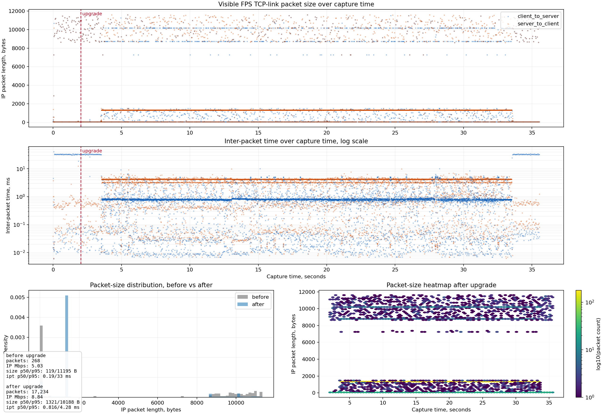
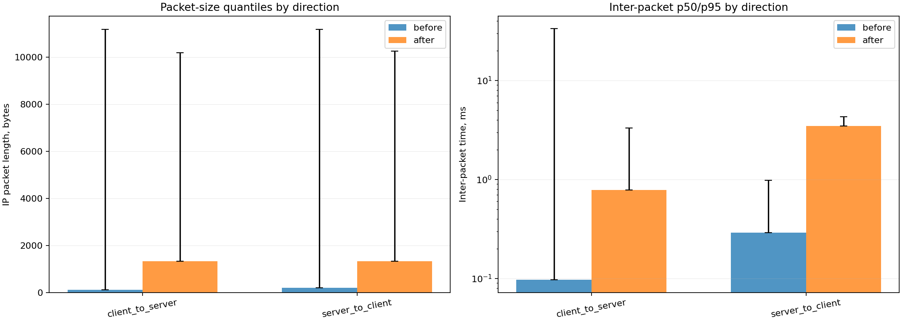
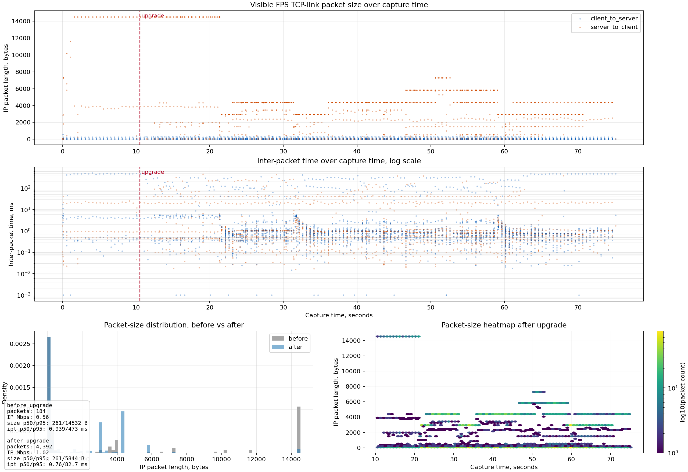
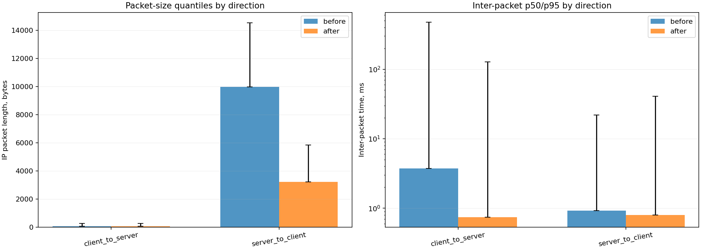

# FPS TCP Flow Shape Experiment

This page records an exploratory pcap analysis of the visible
`fps_client <-> fps_server` TCP flow before and after Zero-RTT upgrade. It is
not a regression gate and it is not a censorship-evasion proof. The goal is to
measure whether the current beta implementation changes packet-size and timing
distributions in a way that is visible below TLS.

## Scenario

The experiment used the current Linux TUN VPN adapter over the generic FPS
covert datagram transport, in a local Docker/TUN topology:

- one `fps_server`;
- one `fps_client`;
- one debug HTTPS/WSS `fps_carrier` origin;
- one persistent WSS carrier client;
- bidirectional UDP `iperf3` traffic over the FPS TUN lease, which the adapter
  mapped to opaque FPS datagrams before transmission.

The carrier generator produced continuous WSS echo traffic. Zero-RTT upgrade was
intentionally delayed with `--pre-upgrade-records 60` so the capture had a small
pre-upgrade window and a longer post-upgrade window. The pcap was captured on
the concrete Docker bridge interface for the FPS TCP link. Capturing Docker
traffic on Linux `any` can duplicate or reorder packets enough to confuse TCP
reassembly and TLS record checks.

Reproduction command:

```sh
FPS_DOCKER_SUDO=1 tools/docker_pcap_flow_experiment.py \
  --image fps:local \
  --duration 30 \
  --bandwidth 2M \
  --iperf-bidir \
  --length 1200 \
  --carrier-bps 300000 \
  --carrier-frame-rate 30 \
  --pre-upgrade-records 60
```

Readable plots were generated from the analyzer CSV/JSON with an optional local
Python venv:

```sh
python3 -m venv .venv
.venv/bin/python -m pip install matplotlib pandas numpy
.venv/bin/python tools/plot_pcap_flow.py \
  --packets-csv captures/<project>/flow-packets.csv \
  --summary-json captures/<project>/flow-summary.json \
  --out-prefix captures/<project>/readable-flow
```

The plotting dependencies are developer-only analysis tools. They are not FPS
runtime, Docker image, CMake or CI dependencies.

## Wire-Shape Check

The captured FPS link still parsed as TLS records in both directions:

```text
total TLS records: 14697
client -> server Application Data records: 7346
server -> client Application Data records: 7347
content types observed: ChangeCipherSpec, Handshake, ApplicationData
```

This confirms only syntactic TLS record framing. It does not say that the flow's
packet sizes and timing still match the carrier's original distribution.

## Plots





## Measured Result

The bidirectional UDP probe completed without packet loss:

| Direction | UDP target | Observed UDP throughput | Lost packets |
| --- | ---: | ---: | ---: |
| client to server | 2 Mbit/s | about 2.00 Mbit/s | 0 |
| server to client | 2 Mbit/s | about 2.00 Mbit/s | 0 |

Visible FPS TCP-link packet statistics:

| Phase | Duration | Packets | IP throughput | IP size p50 | IP size p95 | inter-packet p50 | inter-packet p95 |
| --- | ---: | ---: | ---: | ---: | ---: | ---: | ---: |
| before upgrade | about 2.02 s | 268 | about 5.03 Mbit/s | 119 B | 11195 B | 0.19 ms | 33 ms |
| after upgrade | about 33.50 s | 17234 | about 8.84 Mbit/s | 1321 B | 10188 B | 0.82 ms | 4.28 ms |

After upgrade, both TCP directions carried roughly 4.4 Mbit/s of visible IP
traffic. The median packet size in both directions moved to approximately
1321 bytes, while the upper tail still contained large WSS/TLS records around
9-11 KiB.

## Interpretation

The current implementation preserves TLS record syntax: Wireshark and the
libpcap checker can still parse the FPS link as TLS. However, the packet-size
and timing distributions visibly change after FPS starts carrying TUN traffic.

The strongest signal in this experiment is not an FPS plaintext marker or a
broken TLS record boundary. It is a traffic-shape signal:

- a new dense band of near-MTU packets appears after upgrade;
- inter-packet timing becomes much more frequent than the pre-upgrade carrier
  cadence;
- bidirectional TUN load makes this effect visible in both directions.

This is expected for the current beta. FPS currently prioritizes correctness,
lease enforcement, classified-record confidentiality and Docker-first operability over
traffic-shape mimicry.

## Engineering Conclusion

The next traffic-analysis work should focus on classified-record scheduling and
shaping, not on TLS record syntactic validity alone. The first shaper increment
now pads inserted classified FPS records to planner-selected full TLS record
wire sizes. The current shaper baseline also trains an adaptive CDF from parsed
carrier TLS records across sessions and can bootstrap clients with encrypted
server snapshots. This is necessary, but not sufficient, for statistical
mimicry.
Useful next experiments:

- compare a pure carrier capture against carrier-plus-FPS captures at several
  TUN rates;
- cap or pace covert datagram frames so they do not create a separate near-MTU
  packet band;
- evaluate whether adaptive CDF scheduling reduces the near-MTU packet band and
  cadence shift visible in this baseline capture;
- add a pcap-level check that compares observed post-upgrade record-size and
  inter-packet distributions against the learned carrier model;
- rerun the same pcap analysis over real browser/application carrier sessions,
  not only the deterministic debug carrier;
- keep `is_pcap_looks_like_tls.py` as a basic wire-shape regression, but add a
  separate research workflow for packet-size/timing distributions.

For now, treat these plots as a diagnostic baseline. They show that FPS is
syntactically TLS-shaped, but not yet statistically shaped.

## Remote Market-Data Carrier Experiment

The next experiment moved away from local Docker loopback and debug WSS traffic.
It used a real remote Linux host for `fps_server`, captured the public
`fps_client <-> fps_server` link on the remote host's Ethernet interface, and
used periodic HTTPS GET requests to a public cryptocurrency exchange market-data
API as the carrier. The exact external service is intentionally not part of the
project documentation; the relevant traffic shape is a small client request
followed by a response of roughly 32 KiB.

Experiment parameters:

- `fps_server` ran on the remote host and listened on TCP port `443`;
- `fps_client` ran locally and connected to that public endpoint;
- the capture filter selected only the client public IP and server TCP port
  `443`, excluding the server's separate outbound connection to the origin;
- the market-data poller used one persistent HTTPS connection, one GET about
  every 0.5 seconds, and 150 total polls;
- `security.zero_rtt.client_upgrade_delay_ms` was set to `10000`, so the plots
  have a visible pre-upgrade learning window;
- the shaper used adaptive record-size and inter-record-delay CDF learning with
  encrypted server-to-client CDF snapshots;
- after upgrade, bounded UDP probes produced opaque FPS datagrams over the TUN
  adapter.

Readable plots from the refined run:





Wire-shape check:

```text
total TLS records: 1033
client -> server Application Data records: 255
server -> client Application Data records: 774
content types observed: ChangeCipherSpec, Handshake, ApplicationData
tcpdump kernel drops: 0
```

Carrier workload:

| Metric | Value |
| --- | ---: |
| Capture duration | about 75.1 s |
| Upgrade split | about 10.5 s after capture start |
| Market-data polls | 150 |
| Market-data response bytes | about 4.81 MiB total |
| Captured packets | 4576 |

Visible FPS TCP-link packet statistics:

Important capture caveat: these packet-size values come from an endpoint capture
on a virtualized Linux host. Large values such as 8-14 KiB are expected when
GRO/GSO/TSO, checksum offload or hypervisor-side aggregation are active; they
represent coalesced packets as exposed to `tcpdump`, not Ethernet frames of that
size on the physical wire and not IP fragmentation. The TLS record parser check
below still validates the byte-stream shape, but exact L2/MTU-size conclusions
require capturing after offload is disabled or from an external tap.

| Phase | Duration | Packets | IP throughput | IP size p50 | IP size p95 | inter-packet p50 | inter-packet p95 |
| --- | ---: | ---: | ---: | ---: | ---: | ---: | ---: |
| before upgrade | about 10.1 s | 184 | about 0.56 Mbit/s | 261 B | 14532 B | 0.94 ms | 473 ms |
| after upgrade | about 64.5 s | 4392 | about 1.02 Mbit/s | 261 B | 5844 B | 0.76 ms | 82.7 ms |

Direction-specific post-upgrade statistics:

| Direction | Packets | IP throughput | IP size p50 | IP size p95 | TCP payload p50 | TCP payload p95 |
| --- | ---: | ---: | ---: | ---: | ---: | ---: |
| client to server | 2189 | about 0.021 Mbit/s | 52 B | 261 B | 0 B | 209 B |
| server to client | 2203 | about 1.00 Mbit/s | 3212 B | 5844 B | 3160 B | 5792 B |

FPS/TUN signal from daemon counters:

| Direction | Probe | FPS daemon result |
| --- | --- | --- |
| client to server | small UDP datagrams | 103 datagram frames, 6144 bytes accepted by the server-side FPS session |
| server to client | 240 UDP datagrams, 1200-byte payloads | 240 datagram frames, 294720 bytes delivered to the client-side FPS session |

An earlier diagnostic run attempted 256-byte client-to-server UDP payloads before
the shaper-aware fragmentation pass. The adaptive shaper learned that this
carrier's client-to-server TLS records were small request records; it therefore
kept the oversized covert payload queued instead of emitting a larger,
easier-to-fingerprint client-to-server TLS record. That was the correct
security-biased behavior for the baseline shaper, but it also showed why FPS
datagram fragmentation belongs directly in the shaped send path: if the next
datagram is too large for the sampled TLS record, FPS should split it into
smaller opaque datagram fragments; if the fragment is smaller than the sampled
record, the classified-record codec can fill the remainder with encrypted
padding.

The refined run used smaller client-to-server UDP payloads so FPS could insert
classified records in both directions. The ad-hoc UDP socket bound to the
server's own TUN address did not receive those local packets, so this experiment
does not claim an application-level client-to-server UDP throughput number.
The daemon counters are still useful for the pcap question: FPS did encode,
send, classify and accept client-to-server datagram frames without breaking TLS
record syntax.

### Remote-Carrier Interpretation

This capture is closer to a real automated carrier than the local WSS debug
baseline. It shows three practical points:

- the link remains syntactically TLS-shaped after upgrade;
- the adaptive shaper respects directional carrier asymmetry instead of forcing
  large records into the thin client-to-server request stream;
- a dense response-heavy HTTPS polling carrier can provide useful
  server-to-client covert capacity, but it is not a balanced full-duplex carrier
  unless the application naturally sends larger client-to-server records too.

The next useful research step is to repeat the same measurement with carriers
whose application protocol is naturally full-duplex or client-upload-heavy, then
compare post-upgrade CDF drift against the carrier-only baseline.
